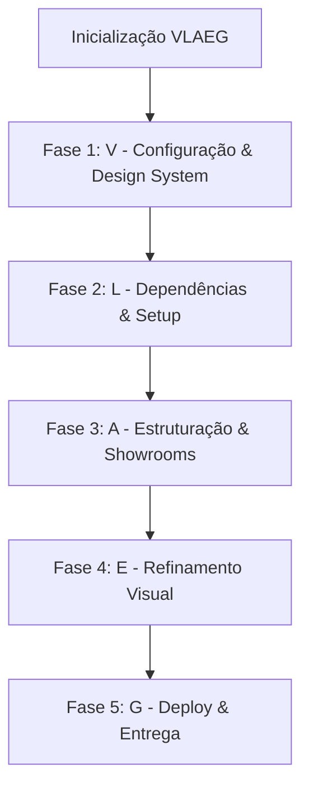

# Plano de Trabalho — Checklist e Fases (task_plan.md)

Este arquivo gerencia a memória e as etapas de execução do projeto de criação do Portfólio VLAEG Creative Studio.

## Blueprint do Projeto (Visão Geral)

---

## Fases de Execução e Checklists

### 🟢 Fase 0: Inicialização e Planejamento
- [x] Criar `findings.md` com as informações extraídas dos PDFs
- [x] Criar `task_plan.md` com checklist de execução
- [x] Atualizar `GEMINI.md` para incluir a constituição do projeto (JSON Schemas, Invariantes e Regras)
- [x] Obter aprovação do usuário para o plano de implementação

### 🎨 Fase 1: Visão e Design System
- [x] Configurar o design system em `src/index.css` (Midnight Luxe: Obsidiana, Champagne, Marfim)
- [x] Configurar fontes ("Inter", "Playfair Display", "JetBrains Mono") no `index.html`
- [x] Implementar overlay global de ruído CSS (SVG Turbulence)
- [x] Definir classes de animação e micro-interações magnéticas

### 📦 Fase 2: Configuração do Projeto e Conectividade (Link)
- [x] Executar o setup do projeto React + Vite no diretório atual
- [x] Instalar dependências: `gsap`, `lucide-react`, `tailwindcss`, `postcss`, `autoprefixer`
- [x] Testar a importação do GSAP e inicialização dos plugins

### 🏗️ Fase 3: Arquitetura e Showrooms
- [x] Criar Navbar ("A Ilha Flutuante") e Hero Section cinemática
- [x] Criar Seção de Features ("Diagnostic Shuffler", "Telemetry Typewriter", "Cursor Protocol Scheduler")
- [x] Criar Seção de Manifesto/Filosofia ("O Manifesto VLAEG")
- [x] Criar a Seção do Showroom com os 3 mini-apps interativos:
  - [x] BarberFlow: Agendador de 4 passos interativo
  - [x] Cosa Nostra: Loja de streetwear interativa com carrinho e filtros
  - [x] ML Estética: Navegador de procedimentos e depoimentos do cliente
- [x] Criar Seção de Protocolo ("Sticky Stacking" com animações SVG/Canvas exclusivas)
- [x] Criar Seção de Planos/Começar e Footer ("System Operational")

### ✨ Fase 4: Estilo e Refinamento
- [x] Aplicar animações GSAP de ScrollTrigger e Stagger
- [x] Garantir micro-interações magnéticas e transições fluidas de hover
- [x] Validar design responsivo mobile-first

### 🛰️ Fase 5: Validação e Lançamento
- [x] Validar carregamento correto de imagens do Unsplash
- [x] Realizar build do projeto para testar erros em tempo de compilação
- [x] Apresentar walkthrough de entrega

